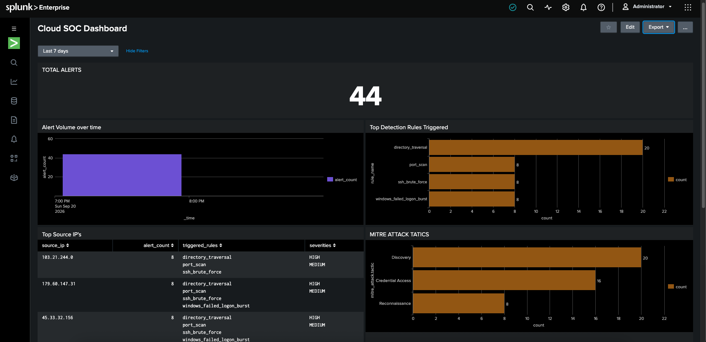
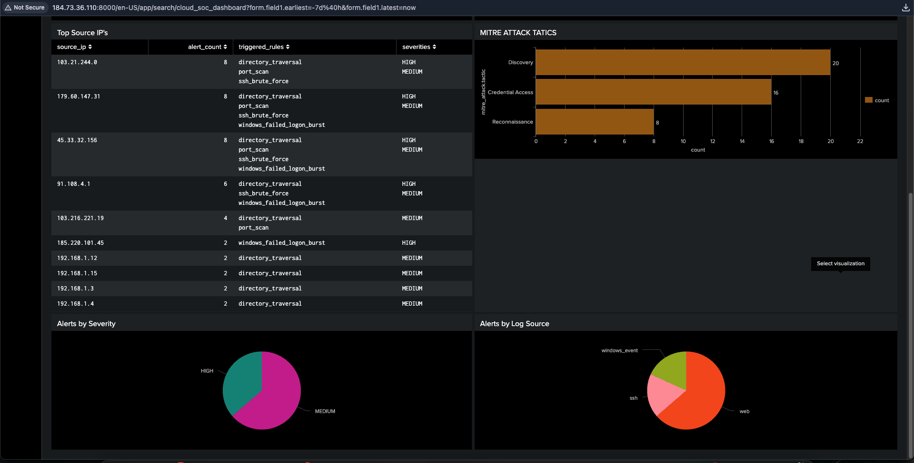
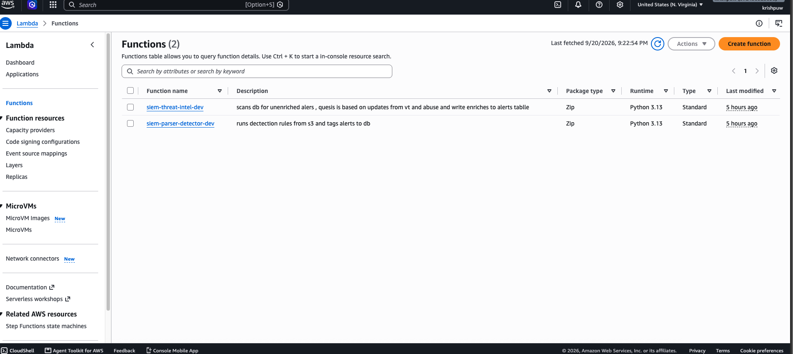
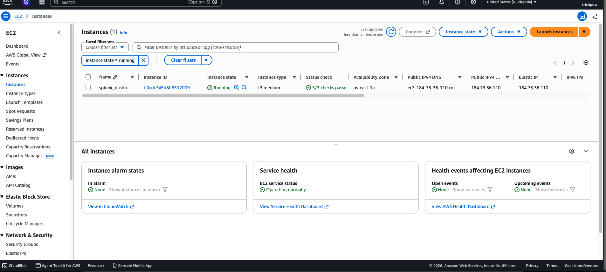
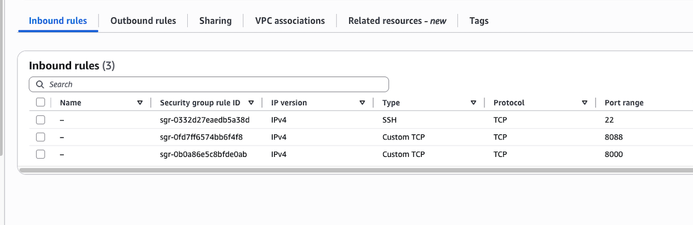
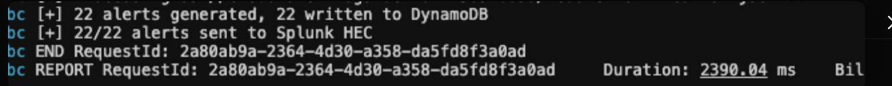

# Cloud-Native SIEM Pipeline

A serverless SIEM built on AWS that ingests security logs, detects threats using
MITRE ATT&CK-mapped rules, enriches alerts with live threat intelligence, and
forwards everything to Splunk for real-time dashboarding.

## Architecture

Deployed on AWS via SAM/CloudFormation. Splunk Enterprise self-hosted on EC2.

## Dashboard


Total alert count, alert volume over time, top detection rules triggered,
and MITRE ATT&CK tactic distribution — the four numbers a SOC analyst
checks first to gauge what's happening right now.



Top source IPs ranked by alert count with their triggered rules and
severities, plus alert breakdowns by severity and log source. This is
where triage actually starts — which IP is the noisiest, and what did
it try.

## Detection Rules

| Rule | Source | Logic | MITRE Tactic |
|---|---|---|---|
| `ssh_brute_force` | ssh | 5+ failed logins, same IP, 60s | Credential Access |
| `port_scan` | web | 10+ distinct paths, same IP, 60s | Reconnaissance |
| `windows_failed_logon_burst` | windows | 5+ failed logons (4625), 60s | Credential Access |
| `sql_injection_attempt` | web | SQLi pattern match | Initial Access |
| `directory_traversal` | web | Path traversal pattern match | Discovery |

## Threat Intel Enrichment

Every alert with a public IP is checked against VirusTotal and AbuseIPDB.
Severity is escalated (never lowered) based on the results — e.g. an SSH
brute-force alert from a Tor exit node with a 100% abuse score gets flagged
`HIGH` automatically, no analyst lookup required.

## AWS Infrastructure



Both detection functions deployed and running: `parser-detector` (triggered
on every S3 upload) and `threat-intel` (runs on a schedule via EventBridge
to enrich unenriched alerts).



Splunk Enterprise self-hosted on a `t3.medium` EC2 instance with an
associated Elastic IP, so the HTTP Event Collector endpoint stays reachable
across restarts.



Inbound rules scoped by purpose: SSH (22) and the Splunk web UI (8000)
restricted to a single trusted IP, while HEC (8088) is open to `0.0.0.0/0`
since Lambda's outbound IP isn't static — the HEC token is what actually
gates access, not the source IP.


Log ingestion bucket. Every upload here triggers `parser-detector`
automatically via an S3 event notification — no polling, no scheduler.

Both Lambdas forward every alert to Splunk via HTTP Event Collector, in
addition to writing to DynamoDB. Splunk forwarding is non-blocking — a
Splunk outage is logged but never fails a detection run.

## Pipeline Verification



## Tech Stack

AWS Lambda · S3 · DynamoDB · SAM/CloudFormation · EC2 · Splunk Enterprise ·
Python · VirusTotal API · AbuseIPDB API

## Setup

```bash
sam build
sam deploy --guided
```

Requires AWS CLI, SAM CLI, Python 3.13, and free-tier API keys from
VirusTotal and AbuseIPDB. Splunk HEC URL/token are optional deploy
parameters — leave blank to run without Splunk forwarding.
